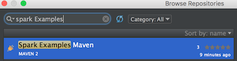
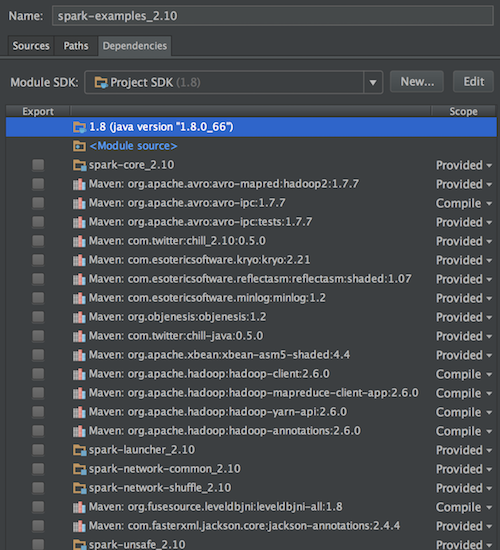
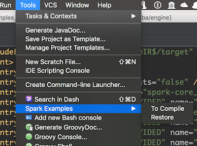

# Spark Examples MVN
This is an IntelliJ IDEA plugin marking the Maven scope to be `compile` of the `examples` module
in [Spark](https://github.com/apache/spark) project.

## Download
- [Latest](https://github.com/ChenZhongPu/Spark-Examples-Maven/raw/master/release/SparkExamplesMvn.jar)

- [All downloads](download.md)

It is recommended that you install `Spark Examples Maven` from IntelliJ IDEA Plugin Repositories.

 

## Motivation
For the developers who building `Spark` in IntelliJ IDEA, they will found that they cannot run the `examples`
directly. This is because most of the Maven scope is set `Provided`, not `Compile`. See [IntelliJ Runtime error](http://apache-spark-developers-list.1001551.n3.nabble.com/IntelliJ-Runtime-error-td11383.html).

However, the number of dependencies of `examples` module is nearly 300. Hence, it is tedious to change it manually.

The flowing is the part of dependencies of `examples` module (in Spark 1.6.1).

## Usage
After you install the plugin, it will only appear in `Spark` project (in other words, it will never appear in any other projects).

Go to `Tools -> Spark Examples`, choose:
- `To Compile`. Change all the `Provided` to `Compile`
- `Restore`. Restore all the Maven scopes.

Then, `Synchronize` the `examples` module.

Note: Usually, it is unnecessary to restore, since the setting of IntelliJ IDEA will not modify the `pom.xml`.
